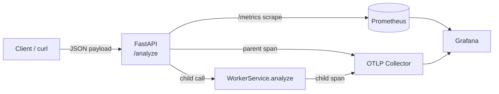

# MicroTrace

MicroTrace is a deliberately small FastAPI service that demonstrates how to roll structured logging, Prometheus metrics, request correlation, OpenTelemetry tracing, and background work co-ordination into one cohesive developer experience.

## System Architecture

- **FastAPI edge** – Receives `/analyze` requests, validates payloads, applies request/response logging, and exposes a `/metrics` endpoint.
- **Request middleware** – Injects request IDs and records Prometheus metrics for every call.
- **Worker service** – Simulates a downstream dependency that performs the actual computation; emits spans/logs so you can follow the full trace.
- **Observability toolchain** – Prometheus scrapes metrics, Grafana visualizes dashboards, and an OTLP collector fans out traces to any backend.



## Feature Highlights

- **Request ID middleware** – Every inbound request includes an `X-Request-ID` header (generated when missing) that propagates through logs and traces so you can stitch all telemetry back to a single call.
- **Prometheus metrics** – Request counts, latency histograms, and error counters are exported from `/metrics`. Grafana dashboards provide ready-to-use visualizations.
- **Structured JSON logging** – `python-json-logger` renders machine-friendly logs that include levels, timestamps, component names, request IDs, and domain-specific fields.
- **Worker service** – `WorkerService` encapsulates the heavy lifting so you can exercise parent/child spans and cross-component logging.
- **Chaos mode (opt-in)** – When `CHAOS_ENABLED=true`, 5% of requests randomly incur a 100–200 ms delay to observe resilience and latency distributions. Disabled by default.
- **OpenTelemetry tracing** – FastAPI, outgoing HTTP calls (if any), and the worker analysis path are instrumented so you can follow the request flow end to end via the OTLP collector.

## Run the API Locally

```bash
python -m venv venv
source venv/bin/activate
pip install -r requirements.txt
export OTEL_EXPORTER_OTLP_ENDPOINT="http://localhost:4318"  # optional tracing
export CHAOS_ENABLED=false
uvicorn src.main:app --reload --host 0.0.0.0 --port 8000
```

- Visit `http://localhost:8000/docs` for interactive Swagger.
- `http://localhost:8000/metrics` exposes Prometheus metrics.

Toggle chaos mode during local runs with `export CHAOS_ENABLED=true`. When enabled, ~5% of requests incur a 100–200 ms delay so you can confirm metrics/trace visualizations capture the outliers.

## Docker Compose (App + Prometheus + Grafana + OTLP)

```bash
docker compose up --build
```

Services:

- `microtrace` – FastAPI app listening on `localhost:8000`.
- `prometheus` – Scrapes `microtrace:8000/metrics` using `prometheus.yml`.
- `grafana` – Pre-loaded dashboard import JSON at `dashboards/microtrace.json`.
- `otel-collector` – Receives OTLP traces/metrics/logs on `4317/4318` and can be wired to Jaeger, Tempo, etc. Update `otel-collector-config.yaml` to forward to your backend of choice.

Need only the collector? Run `docker compose up otel-collector` to expose OTLP gRPC/HTTP endpoints without launching the rest of the stack.

## Example Requests

```bash
curl -X POST "http://localhost:8000/analyze" \
  -H "Content-Type: application/json" \
  -H "X-Request-ID: demo-123" \
  -d '{"a": 10.5, "b": 3.5}'
```

Example response:

```json
{
  "sum": 14.0,
  "difference": 7.0
}
```

## Example JSON Logs

```json
{"asctime": "2025-01-03T12:00:01.234Z", "levelname": "INFO", "name": "microtrace.request", "message": "request_completed", "request_id": "demo-123", "method": "POST", "path": "/analyze", "status_code": 200, "elapsed_ms": 12.7}
{"asctime": "2025-01-03T12:00:01.240Z", "levelname": "INFO", "name": "microtrace.api", "message": "analyze_response", "request_id": "demo-123", "sum": 14.0, "difference": 7.0}
```

## Example Metrics Output

```text
# HELP requests_total Total number of HTTP requests processed.
# TYPE requests_total counter
requests_total{method="POST",path="/analyze",status="200"} 42.0
# HELP request_latency_seconds Request latency in seconds.
# TYPE request_latency_seconds histogram
request_latency_seconds_bucket{method="POST",path="/analyze",le="0.05"} 40.0
request_latency_seconds_bucket{method="POST",path="/analyze",le="0.1"} 42.0
request_latency_seconds_sum{method="POST",path="/analyze"} 1.3
```

## Observability Stack

| Component | Endpoint | Notes |
|-----------|----------|-------|
| MicroTrace API | `http://localhost:8000` | REST + metrics |
| Prometheus | `http://localhost:9090` | Use PromQL to explore counters/histograms |
| Grafana | `http://localhost:3000` | Default credentials `admin/admin`; import `dashboards/microtrace.json` |
| OTLP Collector | `0.0.0.0:4317` gRPC / `0.0.0.0:4318` HTTP | Update config to ship traces elsewhere |

## OpenTelemetry Collector

The Docker Compose stack includes an `otel-collector` container. Customize `otel-collector-config.yaml` to add exporters (Jaeger, Tempo, Honeycomb, etc.). Point the app at the collector via:

```bash
export OTEL_EXPORTER_OTLP_ENDPOINT="http://localhost:4318"
export OTEL_TRACES_SAMPLER="always_on"
```

The FastAPI app auto-detects the settings through OpenTelemetry environment variables defined in `src/tracing.py`.

## Future Enhancements

- Feature-flagged downstream calls to showcase retries and circuit breakers.
- Additional Grafana panels that link metrics and traces using exemplars.
- Synthetic load generator to keep dashboards alive during demos.
- Deployment manifests (Helm/Kubernetes) to show production readiness.

**Why recruiters care:** MicroTrace proves you understand how to fit middleware, metrics, tracing, and logging together. It demonstrates:

- Awareness of cross-cutting concerns (correlation IDs, chaos testing)
- Comfort wiring telemetry pipelines and dashboards
- Ability to document systems clearly for teammates and SREs
- Familiarity with modern Python service patterns
